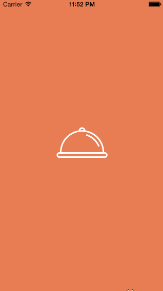

# Tip-Calculator

This is the tip calculator as demonstrated in the prework video demo.

Time spent: 8 hours

Completed user stories:

* [x] Required: User can enter a bill amount, select one of 3 tip percentages, and see the resulting tip and total amounts.

* [x] Optional: Added color, custom fonts, and some formatting improvements (always show $ sign and right-align bill field)

* [x] Optional: Added animations and self-advancing behavior that detects when the user's done typing the bill total, then asks for the tip amount.

* [x] Optional: Added a Clear button that resets the app to its original state

* [x] Optional: Added app icon and launch image

Walkthrough of all user stories:

Video Walkthrough

GIF created with [LiceCap](http://www.cockos.com/licecap/).
